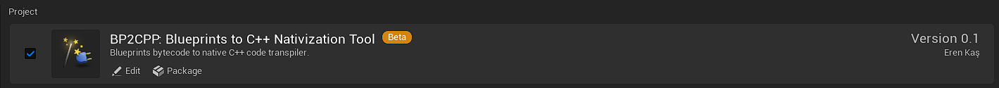
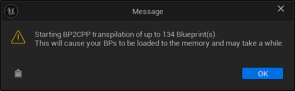
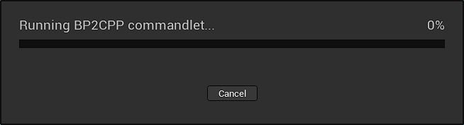
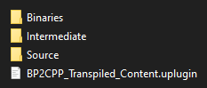

Welcome to BP2CPP documentation. This writing will cover the necessary steps to integrate BP2CPP to your project and explanations about how you can use it.

# What is BP2CPP?

BP2CPP (Blueprint to C++) is an optimizing bytecode-to-source _transpiler_ that converts the Blueprint programming language of Unreal Engine into C++ code to improve runtime performance of the game.

BP2CPP works by parsing the data format that Blueprints programming language get compiled into: "bytecode". Bytecode is the exact and most precise definition of what user code is and how user code is executed in the underlying program that runs the Blueprints code. Once the data is parsed by BP2CPP, it creates an abstract syntax tree (AST) which is a form of representation of the bytecode data format we just parsed that allows BP2CPP to interact and modify the bytecode without actually affecting the original source of data.

First nativization tool that is provided by Epic was parsing the byproducts of node graph (K2Node system and KismetCompilerStatement types) and attempting to generate C++ code from the extracted data. However this idea and implementation never worked because the node graph itself is not a correct representation of how the Blueprints code get executed when it's compiled. Blueprints is a very complex and interesting programming language that has multiple layers of compilation process, and K2Nodes encapsulate their own compilation behaviors into classes called "KCHandler" which expands to "Kismet Compiler Handler". Each compiled K2Node generates at least one (usually multiple) "KCST" which expands to "Kismet Compiler Statement", which then compiler generates bytecode from. 

Instead of interacting with this complex compilation layers, BP2CPP starts transpiling the Blueprints _after_ they are compiled and their bytecode is generated properly by the compiler. And having a flexible AST system instead of just generating code in the parsing process of the nativization allows BP2CPP to implement a "transform pass", where compiler optimizations can happen like how it happens in C++ compilers. For example, one optimization implementation of BP2CPP called **Node Evaluation Optimization** allows BP2CPP to fold local (hidden) variables that exists in the graph into local C++ variables, allowing C++ compilers to perform dead code elimination, constant folding and common subexpression elimination optimizations which sometimes makes compiled BP2CPP code's assembly output look almost same as a compiled handwritten C++ code's assembly output. 

And the best part is, BP2CPP does not replace the existing Blueprint classes, but replaces the "path to BPVM" (`UObject::ProcessEvent`) to route the incoming function calls to generated C++ functions. Generated code still relies on bytecode and reflection data, and since we strictly rely on compatibility between BPVM and BP2CPP code, we do not nativize the "data" (variables, reflection information, components, etc.) that exists in Blueprint classes. This allows us to avoid data corruption errors that was happening with official nativization tool.

# Enabling BP2CPP

First step to integrate BP2CPP to your project is adding plugin files into your project folder's `/Plugins` directory.

Later on, if it's not already enabled by default, you're going to have to enable it in either your `.uproject` or through the plugins tab in the editor:



**Currently, packaged builds of BP2CPP that does not contain source files only contain binaries for `Development`, `DevelopmentEditor` and `Shipping` targets because of limitations with plugin packager of Unreal Engine.**

# Using BP2CPP


Once you enabled BP2CPP plugin, you'll see this button in the toolbar (currently it doesn't have any icon or a texture). After you adjust the settings of BP2CPP to your liking by reading the guide below, all you have to do is click this button.



BP2CPP will display the _potential_ amount of Blueprints that it can transpile. You can expect this number to be lower than what is displayed because BP2CPP skips "illegal" functions and classes to transpile.

Illegal classes or functions are editor-only types that don't exist in shipping, or have corrupted data in the reflection system. You can see the classes that BP2CPP skipped, if there were any, in the output log after transpilation is finished.



After you press the "OK" button, this dialog will appear. Because of an ongoing issue related with parsing the output log of the created BP2CPP commandlet process, progress bar won't update, so do not worry if you see no progress for a while.

Transpiling a project often takes a few minutes only. With most marketplace/example projects, it takes merely a few seconds.

After transpilation is finished, you'll find a new plugin in your project's `/Plugins` folder named `BP2CPP_TranspiledContentPluginFolder`



`Source/BP2CPP_Transpiled_Content/BP2CPP_Content.combined.cpp` contains the code BP2CPP generated from Blueprints. **Do not modify or use contents of this file directly.**

After you check logs and confirm that the transpilation succeeded, restart your editor, and you're ready to package your project. Note that if logs are red or yellow, that doesn't necessarily mean the transpiler failed, as the engine outputs the previous log color after a child process finishes executing.

### Only transpile your project right before packaging your project!

BP2CPP relies on information that the reflection system and Blueprint compiler provide. However, for performance reasons, it "hardcodes" some of this information into the generated code. This causes BP2CPP to not remain synced with the rest of your project if you nativize a class and then modify it.

If you modify any Blueprint class that you transpiled earlier and ship your project, you will see an error like this if assertions are enabled:

```
BP2CPP: Script size mismatch! Current serialized size: 24, transpiler time size: 18
```

### Running BP2CPP through commandlet

BP2CPP is available as a commandlet: `-run=Bp2cppCommandlet`

There are no command line arguments or switches, so you have to rely on the .ini file or settings in the editor to affect the behavior of the transpiler.

### Profiling BP2CPP

If you ship with stats enabled, you can see `Blueprint Time (Nativized)` and `Blueprint Time (VM)` with `stat game` command:

- `Blueprint Time (Nativized)` will show the amount of time taken
- `Blueprint Time (VM)` shows the time of the functions that BP2CPP did not nativize, but their call reached to BP2CPP's code, and re-routed back to BPVM.

If you prefer Unreal Insights, there is also a trace channel named `Bp2cppTraceChannel` (you need to enable this channel manually):

- `ProcessEventRouteMap_NativizedRoute` will show the amount of time taken
- `ProcessEventRouteMap_BPVMRoute` shows the time of the functions that BP2CPP did not nativize, but their call reached to BP2CPP's code, and re-routed back to BPVM.

# Settings

Settings can be adjusted through `DefaultGame.ini` or from the project settings. **We recommend not changing the default values of the options that aren't editable in the project settings through the `.ini` file.**

## Nativization Class filter

Class filter is an `FARFilter` type that's provided by the engine. BP2CPP uses Asset Registry to collect assets to transpile through the filter provided with this option. By default, Class Filter will collect all blueprint assets in the project that are browsable through Content Browser.

## Exclusion Paths

Exclusion paths exist to provide an easy way to exclude paths from Class Filter.

## Use Top Level Path Based Lookup

This option enables BP2CPP proxy classes to generate a code that performs lookups for generated functions through `FTopLevelAssetPath` instead of object path names, which are significantly slower in comparison because of string hashing and default `UObject::GetPathname` overhead. This feature is not enabled by default because it's rather new and not tested thoroughly. However, it never crashed any project or broke anything so far, we highly recommend users to enable this option and perform playtests to benefit from the greater performance of `FName` based lookups through `FTopLevelAssetPath`.

## Suppress Compiler Optimization Warnings

If the user has incredibly big function graphs, or the event graph contains a lot of nodes, BP2CPP might encounter a limitation of the C++ compiler. Compilers take a lot of time to analyze and optimize the code blocks, and this often happens on a per function-basis. Because of how Blueprints internals are designed, BP2CPP generates an interpreter logic for each function graph, and one big interpreter logic for the entirety of the event graph functions. This may cause the compiler to process more than it could handle, so sometimes compilers refuse to compile code generated by BP2CPP. This is a limitation of the C++ compilers, so we can do little about it, however, there are two workarounds:

- Enable this boolean and suppress the warning, but MOST LIKELY the compiler won't optimize the code at all, so you might get a serious performance hit.
- Add 'AdditionalCompilerArguments += "/d2OptimizeHugeFunctions"' to your Target.cs, this will force MSVC to optimize the code, but it will take a lot of time to compile.

The second option requires a source build of Unreal Engine.

We recommend not creating overly big event graph and/or function graphs to avoid this issue completely. As long as common programming practices are followed, it's almost impossible to encounter this limitation. Even with marketplace products with massive event graphs like Fluid Ninja Live, we did not see this error happening.

## Trace Native Calls For Profiling

Whether code generator should add insights trace marks per native call or not.

This basically does what `P_NATIVE_BEGIN` and `P_NATIVE_END` macros does in BPVM.

Tracing *each* native call might be costly, so be careful when comparing with BPVM.

Do NOT keep this enabled in release builds.

## Warn On Unsafe Blueprint Calls

As of UE5.0, BP compiler "intentionally" introduces a bug that allows Blueprint code to call functions that don't exist in packaged builds in the BP assets that are cooked for shipping. This happens if the called native function is declared within an Uncooked/Developer module. In this scenario, in the packaged project/game, execution of the function would end up with crash or memory corruption across the program.

However, when BP2CPP is enabled, since to call the function in C++, we need to have a declaration of it, BP2CPP will fail to compile the code as the transpiler will add a reference to an Uncooked/Developer module in `Build.cs`, which isn't allowed in a packaged build.

Enabling this boolean allows users to be aware of the potential issue by prompting a warning in Blueprints compiler and lets them take necessary actions to prevent it.

## Transpile Functions With Editor Only Properties

If you set a property in Blueprint editor as "editor-only," Blueprint's compiler still ships the property as an existing member variable unlike C++ properties, but in runtime it performs a check to ensure it's not evaluated inside the BPVM. BP2CPP scans for the information of the properties through reflection system during transpilation to decide whether it should also perform those checks or not.

Disabling this option makes BP2CPP to prefer not transpiling Blueprint objects that are using editor-only properties in their functions, this way they are not added to the transpilation list before code generation happens.

We ran multiple tests with this option enabled and didn't encounter any issues, but still wanted to leave it in the Options menu to provide flexibility for the future cases.

# Optimization Settings

## Allow Inlined Root Nodes

Because of compilation time optimizations and compiler limitations, we had to add `FORCENOINLINE` to the root nodes of the opcode functions. Enabling this would cause transpiler to use `BP2CPP_UNSPECIFICIED_INLINE_OPTION` macro, which evaluates to nothing, allowing the compiler to inline root nodes if it feels like it. As long as it works for your project, feel free to enable this option. We ran our tests with this option enabled and didn't encounter any issues so far with MSVC. Based on comments in LLVM forums, we don't expect this option to cause any issues on clang either.

## Return Instead Of Break on End Of Script Opcode

Generates a `return;` statement instead of `break;` in the main interpreter loop. This is a micro optimization.

## Force Inline Root Nodes

**NOT RECOMMENDED.**

Marks all root nodes as `FORCEINLINE`. In an ideal world, where compilers are more capable of handling large functions, this would be the best option. However, enabling this option causes compilers to either fail to compile the generated code or take unbearable amount of time (more than 30 minutes).

## Blueprint Struct Copy Optimizations Enabled

BP2CPP can detect when you're copying a Blueprint struct type and perform fast path optimizations for it, skipping virtual calls. If the struct is a POD type, BP2CPP will also understand it and perform a `memcpy` instead of calling reflection functions.

## Array Copy Optimizations Enabled

BP2CPP can detect when you're copying an array that has a native inner type (i.e. `TArray<int32>` for example, instead of an array with BP struct type) and copy it more effectively compared to the reflection system.

## Inline Function Graph Root Nodes Into Callsites & Inline Event Graph Root Nodes Into Callsites

Inlines all generated code into the generated main interpreter switch instead of calling functions. Performance of this option is not tested, but we recommend users to enable it and keep `MaxTreeDepth` below 1024.

## Pure Node Result Eval Optimization

**We recommend you to keep this option enabled.**

All C++ compilers optimize the code better if the origin of the memory CPU is going to operate on is not anonymous to the optimizer.

When reading values from stack/locals, we generate a code similar to the following:
```cpp
uint8* SomeMemory = reinterpret_cast<uint8*>(Stack.Locals + Offset);
```

At this point, the compiler only knows that `SomeMemory` is a pointer to uint8, and it doesn't know what it points to. Meanwhile, `SomeMemory` just points to a stack allocated value that is initialized just before the main interpreter switch runs. However, compiler heuristics are not enough to understand that.

To overcome this, we allocate clone variables for each local variable in the stack, and use them instead of the raw memory:
```
bool SomeLocalVariable{};
uint8* SomeMemory = reinterpret_cast<uint8*>(&SomeLocalVariable);
```

This gives the compiler more information about where the data came from, and depending on the scenario, practically creates equivalent output to a handwritten C++ code. Example: [https://godbolt.org/z/3cvvdf8o4]

Information on which variables are eligible for this optimization is directly fetched from Blueprint Compiler when transpiler is compiling Blueprints. If user code is written with correct object-oriented programming principles, this optimization can be performed on more variables.

Currently, we're only able to perform this optimization for plain old data types.

**Recommendations (none of these are hard rules, but they help):**
- Break your logic into smaller blocks of code or smaller functions.
- Do not plug pure-node chains into multiple inputs of impure nodes, instead prefer caching them into a local variable. This is also a common performance optimization in Blueprints itself.
- Prefer declaring your structs in C++ and using them in Blueprints instead of creating them in Blueprints. This allows transpiler to use actual C++ types instead of interacting with anonymous memory block.
- Prefer using plain old data types for math operations. (This is required for this optimization to work)

# Experimental Options

**Do NOT ship with experimental options enabled.**

## Reverse Folding Algorithm

Whether to scan the AST in reverse order to fold the nodes. This might improve the performance because transpiler will be able to combine more nodes into a single function body.

## Perform Compiler Separate Storage Optimizations

Enabling this allows compilers to assume that local variables don't alias each other, so the compiler won't reload the memory for each local variable access, and will use a cached value instead.

This might provide a significant performance boost, but it's not guaranteed. This option relies on `__builtin_assume_separate_storage` and `__assume` intrinsics. It's likely to be more effective in LLVM based compilers like clang.

# Troubleshooting

Enable all options listed below in project settings:

- Enable Developer Options (only if transpiler is crashing before generating code)
- Run with '-stompmalloc' (only if transpiler is crashing before generating code)
- Dump Constructor Types Of Parent Native Classes
- Dump Blueprint Bytecode
- Dump Const Struct Traversal
- Log Referenced Modules and Sources

These will provide required information for us to debug the errors.

# Limitations

BP2CPP won't ever cause any limitations related to how users script their code in Blueprints, but there are some side effects of being able to run BP2CPP on a shipping build.

## When a Blueprint function is called through `UObject::ProcessEvent`, it won't ever reach your override in native classes if transpiled Blueprints derived from the closest native class.

For example, let's say you have a `ABird` class that is derived from `AActor`, and have a `BP_Bird` that is derived from `ABird`.

```cpp
UCLASS()
class ABird : public AActor
{
    // overridden function of Fly() is declared in BP_Bird
    UFUNCTION(BlueprintImplementableEvent, Category="Bird")
    void Fly();

    virtual void ProcessEvent(UFunction* Function, void* Parms)
    {
        // this log will be never displayed if Fly() is overriden in BP_Bird and transpiled with BP2CPP because this override of ProcessEvent won't ever be executed.
        UE_LOG(LogTemp, Display, TEXT("ProcessEvent from ABird is called.");)
    }
};
```

Since `Fly()` is a `BlueprintImplementableEvent`, calling it would result in a `ProcessEvent` call (through the code `.gen.cpp` files that UHT generated) which would end up in BP2CPP's generated "proxy" classes. A proxy class is a derived class of your Blueprints' "closes native classes" to route the incoming calls to BP2CPP instead of to BPVM when they are called. Proxy classes exist to replace the virtual function table of the native classes, and they are declared in the generated BP2CPP code.

If `Fly()` is not overridden in `BP_Bird`, then proxy classes would route the incoming call back to `ABird::ProcessEvent`.

## BP2CPP only runs in monolithic builds.

Because of some functions are not exported but still callable in Blueprints, we decided to go with the option of making BP2CPP only run in monolithic builds. 
